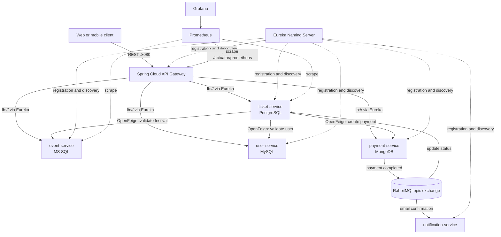

# Festival and Ticketing Management System

A complete academic reference implementation of a production-oriented microservice platform for managing
festivals, ticket reservations, purchases, payments, and confirmation notifications. The system contains
**exactly five business microservices**, plus a Netflix Eureka naming server and a Spring Cloud API Gateway.

## Technology baseline

- Java 21
- Spring Boot 4.1.0
- Spring Cloud 2025.1.2
- Spring Cloud Netflix Eureka and Spring Cloud Gateway Server WebFlux
- Spring Cloud OpenFeign for synchronous service-to-service calls
- RabbitMQ for asynchronous domain events
- MS SQL Server, PostgreSQL, MySQL, and MongoDB
- Flyway migrations for all relational databases
- JUnit 5, Mockito, and Testcontainers 2.0.5
- Micrometer, Prometheus, and Grafana
- Docker Compose and Kubernetes manifests

## Business services

| Service | Responsibility | Storage | Port |
|---|---|---|---:|
| `event-service` | Festival CRUD; `Festival(id, naziv, lokacija, maksimalniKapacitet)` | MS SQL Server | 8081 |
| `ticket-service` | Capacity-safe reservations, expiry, cancellation, and purchase orchestration | PostgreSQL | 8082 |
| `user-service` | Accounts, BCrypt password hashes, activation, and roles | MySQL | 8083 |
| `payment-service` | Idempotent simulated payment processing | MongoDB | 8084 |
| `notification-service` | RabbitMQ consumer that logs simulated confirmation email | none | 8085 |

Infrastructure endpoints:

| Component | URL / port |
|---|---|
| API Gateway | <http://localhost:8080> |
| Eureka dashboard | <http://localhost:8761> |
| RabbitMQ management | <http://localhost:15672> (`festival` / configured password) |
| Prometheus | <http://localhost:9090> |
| Grafana | <http://localhost:3000> (`admin` / configured password) |

## Architecture



### Purchase flow

1. A client creates a reservation through the Gateway.
2. `ticket-service` uses OpenFeign and Eureka load balancing to verify that the user is active and the
   festival exists.
3. A PostgreSQL inventory row is created idempotently and locked with `PESSIMISTIC_WRITE`; the ticket is
   allocated only when `active_tickets < maksimalniKapacitet`.
4. A purchase request synchronously invokes `payment-service`. One MongoDB document per ticket makes the
   payment endpoint idempotent.
5. `payment-service` publishes a durable `payment.completed` event to the `festival.events` topic exchange.
   Separate durable queues fan the event out to `ticket-service` and `notification-service`.
6. `ticket-service` idempotently marks the ticket as `PURCHASED`; `notification-service` logs the simulated email.

## Repository layout

```text
festival-ticketing-microservices/
├── service-discovery/       # Eureka Server
├── api-gateway/             # Spring Cloud Gateway
├── event-service/           # MS SQL + JPA + Flyway
├── ticket-service/          # PostgreSQL + Feign + RabbitMQ
├── user-service/            # MySQL + BCrypt
├── payment-service/         # MongoDB + RabbitMQ publisher
├── notification-service/    # RabbitMQ consumer
├── monitoring/              # Prometheus and Grafana provisioning
├── k8s/                     # Deployments, Services, dependencies, Kustomize
├── database/mssql/          # Local MS SQL database bootstrap
├── .github/workflows/       # Build, test, image, and deployment pipeline
├── docker-compose.yml
└── pom.xml                  # Maven reactor parent
```

## Run locally with Docker Compose

Requirements: Docker Engine 24+ with Compose v2 and at least 6 GB of memory available to Docker. SQL Server
alone needs approximately 2 GB.

```bash
cp .env.example .env
# Replace every example password in .env before shared or persistent use.
docker compose up --build -d
docker compose ps
```

Wait until `docker compose ps` reports the application containers as healthy. The first build downloads Maven
dependencies and can take several minutes. Follow all logs or the simulated emails with:

```bash
docker compose logs -f --tail=200
docker compose logs -f notification-service
```

Stop the system without deleting data:

```bash
docker compose down
```

Delete local volumes as well (destructive):

```bash
docker compose down -v
```

## End-to-end example

All public calls go through the Gateway.

1. Create a customer:

   ```bash
   curl -sS -X POST http://localhost:8080/api/users \
     -H 'Content-Type: application/json' \
     -d '{"email":"ana@example.com","password":"very-secret-123","ime":"Ana","roles":["CUSTOMER"]}'
   ```

2. Create a festival:

   ```bash
   curl -sS -X POST http://localhost:8080/api/festivals \
     -H 'Content-Type: application/json' \
     -d '{"naziv":"Demo Fest","lokacija":"Novi Sad","maksimalniKapacitet":1000}'
   ```

3. Reserve a ticket using the returned user and festival IDs:

   ```bash
   curl -sS -X POST http://localhost:8080/api/tickets/reservations \
     -H 'Content-Type: application/json' \
     -d '{"userId":1,"festivalId":1,"cena":49.99}'
   ```

4. Purchase the reservation using its UUID:

   ```bash
   curl -sS -X POST http://localhost:8080/api/tickets/REPLACE_WITH_TICKET_UUID/purchase
   ```

   The purchase endpoint returns HTTP 202 while RabbitMQ completes the final state transition. Read the ticket
   again and inspect notification logs after a short moment.

## Build and test without Compose

Requirements: JDK 21, Maven 3.6.3+, and Docker for integration tests.

```bash
mvn -B -ntp clean verify
```

Unit tests use JUnit 5, AssertJ, and Mockito in `event-service`, `ticket-service`, `user-service`,
`payment-service`, and `notification-service`. Integration tests use disposable Testcontainers databases:

- `TicketServiceIntegrationTest` uses PostgreSQL and exercises the Flyway/JPA reservation path.
- `UserServiceIntegrationTest` uses MySQL and exercises persistence plus BCrypt authentication.

Tests annotated with `disabledWithoutDocker = true` are skipped when no compatible container runtime exists.

## CI/CD pipeline

`.github/workflows/pipeline.yml` contains three stages:

1. `test` runs the complete Maven reactor, including Testcontainers integration tests.
2. `container-images` builds all seven application images and pushes them to GHCR outside pull requests.
3. `deploy` validates Kustomize manifests and, when the `KUBE_CONFIG_B64` repository secret exists, applies them
   to a Kubernetes cluster and waits for the Gateway rollout.

Before enabling deployment, replace `ghcr.io/replace-me` in `k8s/*.yaml` with the registry/owner used by the
pipeline and create a base64-encoded kubeconfig secret named `KUBE_CONFIG_B64`.

## Kubernetes

Each application has a Deployment and ClusterIP Service with readiness/liveness probes and resource requests.
The included data-store Deployments use ephemeral `emptyDir` volumes only to keep the academic example
self-contained. For production, use managed databases/broker or StatefulSets with encrypted PVCs, backups,
anti-affinity, disruption budgets, and database-specific high availability.

Replace the example secrets and image owner, then apply:

```bash
kubectl apply --dry-run=client --validate=false -k k8s/
kubectl apply -k k8s/
kubectl -n festival-system get pods,services
```

To expose the Gateway locally:

```bash
kubectl -n festival-system port-forward service/api-gateway 8080:8080
```

## Monitoring

Every application exposes health probes and Prometheus metrics through Spring Boot Actuator. Prometheus scrapes
`/actuator/prometheus`; Grafana is pre-provisioned with the Prometheus data source and a service availability
dashboard. Actuator endpoints are intentionally exposed only on container/cluster networks in the supplied setup.

## Configuration and production hardening

Configuration uses environment variables with local-development defaults. Do not use the example credentials in
a shared environment. A production rollout should additionally provide:

- a secret manager (Vault, External Secrets, or cloud-native equivalent), TLS, and network policies;
- OAuth2/OIDC JWT validation at the Gateway and service-level authorization (the included `/authenticate`
  endpoint only demonstrates password verification, not token issuance);
- managed, replicated data stores and RabbitMQ quorum queues;
- an outbox/CDC relay for guaranteed atomic payment persistence and event publication;
- distributed tracing, centralized logs, alert rules, backups, and restore testing;
- ingress, DNS, certificates, autoscaling, PodDisruptionBudgets, and topology spread constraints.

These are explicit deployment concerns rather than hidden assumptions in the academic sample.
